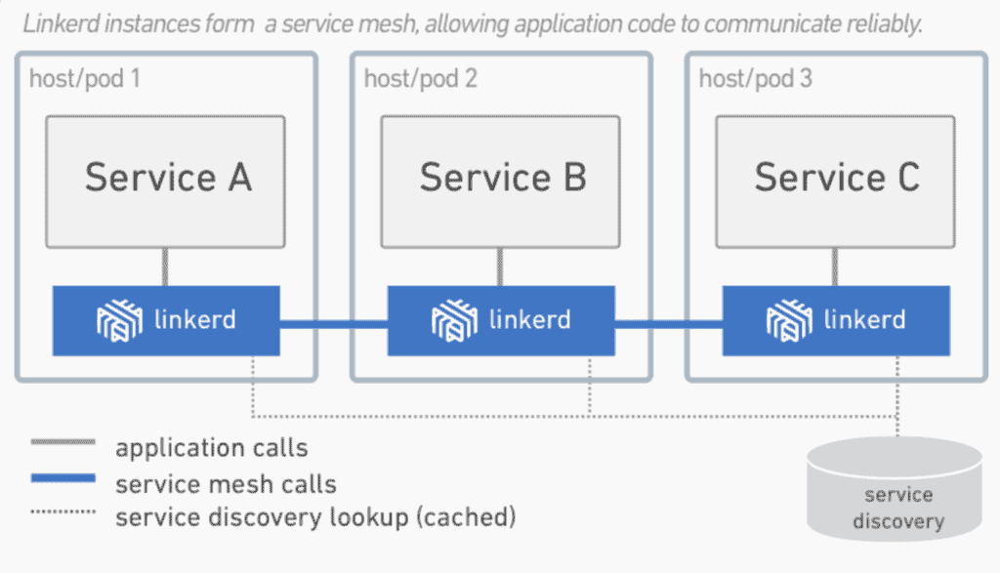

### Introduction

This research aims to explore the synergies between service orchestration in Kubernetes and the integration of digital twins to enhance scalability, efficiency, and overall performance in complex systems. Digital twins, virtual representations of physical entities, provide real-time insights into the state and behavior of assets. When integrated with Kubernetes, a powerful container orchestration platform, they offer opportunities for dynamic adaptation, resource optimization, and intelligent decision-making in service-oriented architectures.

### Objectives

**Optimizing Resource Allocation**

Investigate how the incorporation of digital twins within Kubernetes orchestrates resource allocation to enhance scalability, mitigate bottlenecks, and optimize the overall utilization of computing resources.

**Dynamic Service Provisioning**

Explore the potential of digital twins in enabling dynamic service provisioning and automatic scaling in response to varying workloads and demands within Kubernetes clusters.

**Fault Tolerance and Self-Healing**

Evaluate the role of digital twins in improving fault tolerance and enabling self-healing mechanisms within Kubernetes, ensuring continuous operation and resilience in the face of failures.

**Real-time Monitoring and Analysis**

Develop methodologies for real-time monitoring and analysis using digital twins to provide actionable insights into the performance of services deployed in Kubernetes clusters.

**Use Cases and Applications**

Identify and assess specific use cases and applications where the integration of service orchestration in Kubernetes with digital twins can bring significant advantages, such as in IoT, smart cities, healthcare, or industrial automation.

### Expected Contributions
* Identification of novel approaches to enhance service orchestration in Kubernetes through the integration of digital twins.
* Insights into how this integration can improve resource management, scalability, fault tolerance, and security within complex systems.
* Guidance for industry practitioners and researchers on implementing and adopting these innovations in real-world scenarios.

### Related Repositories
n/a

### Publications
n/a