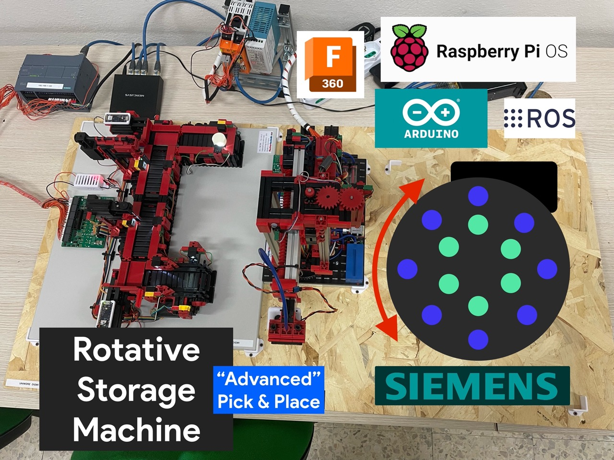
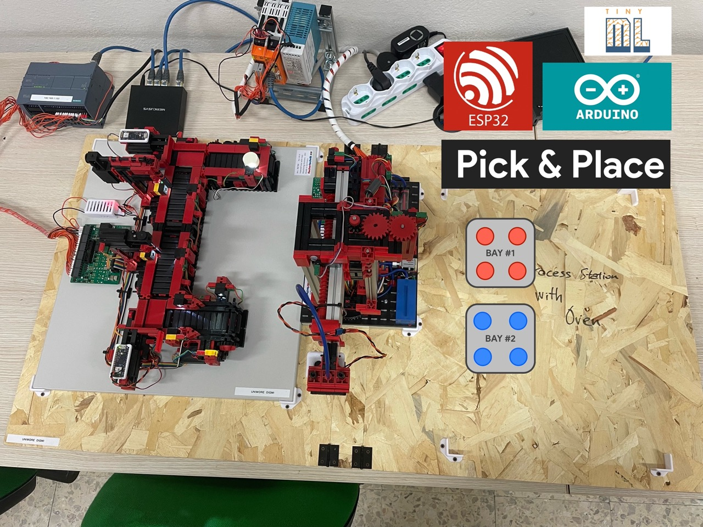

# Thesis Idea & Topics - Update 26/01/2026

### Internet of Things & Industrial IoT

| Title                                                  | Description                                                                                                                                                                                                                                                                                                                                                                      | Topics                                                                                                                              | Links                                                                                                                                                                     |
| ------------------------------------------------------ | -------------------------------------------------------------------------------------------------------------------------------------------------------------------------------------------------------------------------------------------------------------------------------------------------------------------------------------------------------------------------------- | ----------------------------------------------------------------------------------------------------------------------------------- | ------------------------------------------------------------------------------------------------------------------------------------------------------------------------- |
| 🏭 **Profinet Protocol in Microfactory**               | Analysis, implementation and experimentation of Profinet protocol in Microfactory environment with industrial validation                                                                                                                                                                                                                                                         | Profinet, IIoT, Microfactory, Industrial Automation, Industrial Protocols                                                           | [Profinet](https://www.profibus.com/), [PI North America](https://www.profinet.us/)                                                                                       |
| ⚙️ **ModBus Protocol in Microfactory**                 | Analysis, implementation and experimentation of ModBus protocol in Microfactory environment with industrial validation                                                                                                                                                                                                                                                           | ModBus, IIoT, Microfactory, Industrial Automation, Industrial Protocols                                                             | [Modbus Organization](https://modbus.org/), [Modbus Protocol](https://www.modbustools.com/)                                                                               |
| 🌐 **oneM2M Platform for IoT**                         | Study and experimentation of oneM2M platform as international IoT standard with implementation in Smart City, Smart Home or Industrial environments                                                                                                                                                                                                                              | oneM2M, IoT Platform, Smart City, Smart Home, Industrial IoT, International Standards                                               | [oneM2M](https://www.onem2m.org/), [Eclipse OM2M](https://wiki.eclipse.org/OM2M)                                                                                          |
| 🔄 **N8N Workflow Automation**                         | Evaluation of N8N platform for IoT workflow automation with development of custom modules and connectors                                                                                                                                                                                                                                                                         | N8N, Workflow Automation, IoT Integration, Custom Connectors, Process Automation                                                    | [N8N](https://n8n.io/), [N8N Docs](https://docs.n8n.io/)                                                                                                                  |
| 🔴 **Rotative Storage Machine** (See next section)     | Development of automated rotative storage system with advanced Pick & Place technology. The system uses a circular warehouse with multiple positions controlled by Siemens PLC, integrated with robotic arms for automatic component sorting. Supported platforms: Raspberry Pi OS, Arduino, ROS and Factory I/O for simulation.                                                 | Pick & Place, Rotative Storage, Siemens PLC, ROS, Raspberry Pi, Industrial Automation                                               | [ROS](https://www.ros.org/), [Siemens](https://www.siemens.com/)                                                                                                          |
| 🔵 **Advanced Pick & Place System** (See next section) | Implementation of multi-bay Pick & Place system for industrial automation with intelligent management of loading/unloading stations. The system includes two storage bays (Bay #1 and Bay #2) with visual status monitoring, integration with microcontrollers (ESP32, Arduino, TinyML) and development of control logic to optimize material flows in Industry 4.0 environment. | Pick & Place, Multi-Bay System, ESP32, Arduino, TinyML, Industry 4.0, Material Flow                                                 | [ESP32](https://www.espressif.com/), [TinyML](https://www.tinyml.org/)                                                                                                    |
| 🐳 **AWS IoT with Docker Containers**                  | Implementation and management of IoT services on Amazon Web Services using containerized architecture. Development of Docker-based microservices for IoT data processing, deployment on AWS ECS/EKS, integration with AWS IoT Core, Lambda functions and cloud-native services for scalable and resilient IoT solutions.                                                         | AWS IoT, Docker, Container Orchestration, AWS ECS, AWS EKS, Microservices, AWS IoT Core, Lambda, Cloud Services, Serverless, DevOps | [AWS IoT Core](https://aws.amazon.com/iot-core/), [AWS ECS](https://aws.amazon.com/ecs/), [Docker](https://www.docker.com/), [AWS Lambda](https://aws.amazon.com/lambda/) |
### Digital Twins

| Title                                                    | Description                                                                                                                                                                                                                                                                                                                                                                                                                                                                                                                            | Topics                                                                                                                                                                              | Links                                                                                                                                                                                                                      |
| -------------------------------------------------------- | -------------------------------------------------------------------------------------------------------------------------------------------------------------------------------------------------------------------------------------------------------------------------------------------------------------------------------------------------------------------------------------------------------------------------------------------------------------------------------------------------------------------------------------- | ----------------------------------------------------------------------------------------------------------------------------------------------------------------------------------- | -------------------------------------------------------------------------------------------------------------------------------------------------------------------------------------------------------------------------- |
| 🎮 **FactoryIO for Digital Twin**                        | Analysis and implementation of FactoryIO for industrial plant simulation with integration in IoT, IIoT and Digital Twin ecosystems                                                                                                                                                                                                                                                                                                                                                                                                     | FactoryIO, Digital Twin, Industrial Simulation, IIoT, Virtual Commissioning                                                                                                         | [Factory I/O](https://factoryio.com/), [Digital Twin Consortium](https://www.digitaltwinconsortium.org/)                                                                                                                   |
| ☁️ **Digital Twin on Microsoft Azure**                   | Design and implementation of Digital Twin solutions using Microsoft Azure Digital Twins platform. Development of custom connectors and modules in Java for bidirectional integration between physical assets and cloud-based digital replicas. Implementation of real-time synchronization, data analytics and cloud service integration for Industry 4.0 applications.                                                                                                                                                                | Digital Twin, Microsoft Azure, Azure Digital Twins, Java, Cloud Integration, IoT Hub, Azure Services, DTDL, Industry 4.0, Cloud Computing                                           | [Azure Digital Twins](https://azure.microsoft.com/en-us/services/digital-twins/), [Azure IoT](https://azure.microsoft.com/en-us/overview/iot/), [DTDL](https://github.com/Azure/opendigitaltwins-dtdl)                     |
| 🎨 **Digital Twin Design Tool**                          | Development of a comprehensive design and development tool for Digital Twin systems using modern web technologies. Creation of a web-based platform with React and TypeScript frontend for visual modeling and configuration, coupled with Python backend microservices for Digital Twin orchestration. The tool enables modular and configurable Digital Twin deployment through drag-and-drop interfaces, template management, and automated microservice generation.                                                                | Digital Twin, Python, React, TypeScript, Web Development, Microservices, Design Tool, Modular Architecture, Configuration Management, Full-Stack, Visual Modeling                   | [React](https://react.dev/), [TypeScript](https://www.typescriptlang.org/), [Python](https://www.python.org/), [FastAPI](https://fastapi.tiangolo.com/), [Digital Twin Consortium](https://www.digitaltwinconsortium.org/) |
| 👤 **Industrial Digital Twin - Human Machine Interface** | Development of adaptive and context-aware Human Machine Interface (HMI) for Industrial Digital Twins. Integration of IoT/IIoT data streams with dynamic UI generation systems to create intelligent interfaces that adapt to user context, operational conditions and physical asset states. Implementation of real-time data visualization, interactive control panels and responsive dashboards that automatically adjust based on Digital Twin status and user roles for enhanced operator experience in Industry 4.0 environments. | Digital Twin, HMI, Human Machine Interface, IoT, IIoT, Adaptive UI, Context-Aware, Dynamic Interface, Real-Time Visualization, Industry 4.0, User Experience, Interactive Dashboard | [SCADA](https://en.wikipedia.org/wiki/SCADA), [HMI Design](https://www.automationworld.com/), [Node-RED Dashboard](https://flows.nodered.org/node/node-red-dashboard), [Grafana](https://grafana.com/)                     |
| 🥽 **Digital Twin & Extended Reality**                   | Integration of Industrial Digital Twins with Virtual Reality (VR), Augmented Reality (AR) and Extended Reality (XR) technologies for immersive data visualization and cyber-physical interaction. Development of real-time 3D interfaces using Unity and C# to display Digital Twin data, enable spatial interaction with industrial assets, and support remote operation and maintenance through immersive experiences on Meta Quest and XR devices.                                                                                  | Digital Twin, VR, AR, XR, Unity, C#, Meta Quest, Real-Time 3D, Immersive Interface, Cyber-Physical                                                                                  | [Unity](https://unity.com/), [Meta Quest](https://www.meta.com/quest/), [WebXR](https://www.w3.org/TR/webxr/)                                                                                                              |
| 🌐 **Digital Twin 2D & 3D Web Visualization**            | Design and development of web-based visualization platform for IoT/IIoT Digital Twins using modern web technologies. Implementation of interactive 2D and 3D visualization interfaces with React and TypeScript frontend, supporting real-time data rendering and interaction with Digital Twin models. Cross-platform responsive design enabling seamless access from desktop and mobile browsers with Python backend APIs for data integration.                                                                                      | Digital Twin, React, TypeScript, JavaScript, Python, 3D Visualization, WebGL, Three.js, Web APIs, Responsive Design                                                                 | [React](https://react.dev/), [Three.js](https://threejs.org/), [TypeScript](https://www.typescriptlang.org/)                                                                                                               |
| 📈 **Digital Twin Monitoring & Logging**                 | Design and implementation of comprehensive monitoring and logging infrastructure for Digital Twin systems using OpenTelemetry standard. Development of distributed tracing, metrics collection and centralized logging pipelines with OpenTelemetry instrumentation, data collection to Prometheus for metrics, Loki for logs aggregation, and Grafana for unified visualization and alerting dashboards across multiple Digital Twin instances.                                                                                       | Digital Twin, OpenTelemetry, Prometheus, Loki, Grafana, Monitoring, Logging, Observability, Metrics, Tracing                                                                        | [OpenTelemetry](https://opentelemetry.io/), [Prometheus](https://prometheus.io/), [Grafana](https://grafana.com/)                                                                                                          |

### Artificial Intelligence & Cyber-Physical Systems

| Title | Description | Topics | Links |
|-------|-------------|--------|-------|
| 🤖 **ML & AI for Cyber-Physical Anomaly Detection** | Development of embedded Machine Learning system for anomaly detection and signal reconstruction in Cyber-Physical Systems. Implementation of ML algorithms on embedded devices using multi-sensor data fusion (accelerometers, cameras, gyroscopes) for real-time behavior analysis, predictive maintenance and anomaly detection in industrial environments. | Machine Learning, AI, Cyber-Physical Systems, Anomaly Detection, Embedded ML, Sensor Fusion, Accelerometer, Gyroscope, Computer Vision, TinyML, Edge AI | [TensorFlow Lite](https://www.tensorflow.org/lite), [Edge Impulse](https://www.edgeimpulse.com/), [TinyML Foundation](https://www.tinyml.org/) |
| 📊 **Digital Twin Insight & Analytics Module** | Design and development of an advanced insight and analytics module for Digital Twin systems. The module leverages Digital Twin storage data to compute automatic analysis of twin behavior over time, providing real-time monitoring, historical trend analysis, and predictive insights. Implementation of data processing pipelines using Python with MongoDB for time-series data and PostgreSQL for relational analytics, enabling comprehensive Digital Twin lifecycle intelligence. | Digital Twin, Python, MongoDB, PostgreSQL, Data Analytics, Time-Series Analysis, Behavior Analysis, Predictive Analytics, Data Pipeline, Business Intelligence, NoSQL, SQL | [MongoDB](https://www.mongodb.com/), [PostgreSQL](https://www.postgresql.org/), [Pandas](https://pandas.pydata.org/), [Plotly](https://plotly.com/) |
| 🧠 **Digital Twin & LLM Integration** | Study, design and implementation of effective integration between Digital Twins and Large Language Models using the Model Context Protocol (MCP). Development of bidirectional communication interfaces enabling both local and remote LLM models to interact with Digital Twin data, enabling natural language queries, automated insights generation, and intelligent decision support for industrial systems through conversational AI interfaces. | Digital Twin, LLM, AI, MCP Protocol, Natural Language, Conversational AI, Local Models, Remote Models | [MCP](https://modelcontextprotocol.io/), [Anthropic](https://www.anthropic.com/), [OpenAI](https://openai.com/) |
| 🔗 **Digital Twin & Federated Learning** | Study and implementation of Federated Learning principles for Industrial Digital Twins. Design and development of a distributed learning module enabling IoT/IIoT Digital Twins to collaboratively train ML models while preserving data privacy and locality. Implementation of federated aggregation algorithms, secure model updates, and central model improvement through distributed learning across multiple physical assets and edge devices. | Digital Twin, Federated Learning, Distributed ML, Privacy-Preserving AI, Edge Learning, Python, TensorFlow Federated | [TensorFlow Federated](https://www.tensorflow.org/federated), [PySyft](https://github.com/OpenMined/PySyft), [Flower](https://flower.dev/) |

### MicroFactory Evolution

#### Rotative Storage Machine

Development of automated rotative storage system with advanced Pick & Place technology. The system uses a circular warehouse with multiple positions controlled by Siemens PLC, integrated with robotic arms for automatic component sorting. Supported platforms: Raspberry Pi OS, Arduino, ROS and Factory I/O for simulation.

#### Advanced Pick & Place System

Implementation of multi-bay Pick & Place system for industrial automation with intelligent management of loading/unloading stations. The system includes two storage bays (Bay #1 and Bay #2) with visual status monitoring, integration with microcontrollers (ESP32, Arduino, TinyML) and development of control logic to optimize material flows in Industry 4.0 environment.

