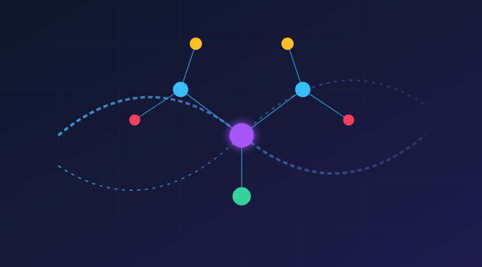
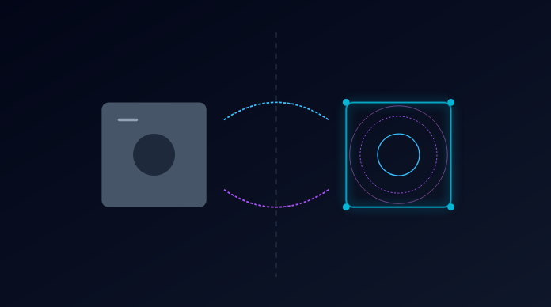
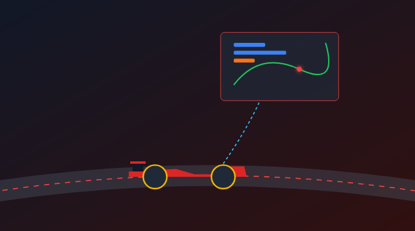

# Thesis Idea & Topics - Update 30/06/2026

Are you passionate about cutting-edge technologies like IoT, Digital Twins, or Artificial Intelligence? Do you want to work on real industrial systems and contribute to Industry 4.0 innovation? 

Choose your thesis topic from our three main research areas:

## 🔗📊 1. RAG & Knowledge Graph for Industrial Intelligence

**Number of students:** up to 2

**Description:**
The thesis aims to evaluate Retrieval-Augmented Generation (RAG) and Knowledge Graph techniques to enrich AI and LLM models with external, domain-driven knowledge in IoT/IIoT scenarios, with the goal of maximizing model effectiveness on industrial tasks. Experimentation will be carried out on Industrial Grade and Microfactory platforms available in the lab, comparing locally deployed and cloud-based models.

**Outcome/Impact:** Open Source Code, Scientific Publication

---

## 💻🤖 2. GenAI and IoT/Industrial Software Engineering and Development

**Number of students:** up to 1

**Description:**
The thesis aims to evaluate techniques for extending the external knowledge and software development capabilities of AI and LLM models applied to IoT/IIoT scenarios, with the goal of improving both model effectiveness and the quality of generated software, including testing aspects. Experimentation will be carried out on Industrial Grade and Microfactory platforms available in the lab, comparing locally deployed and cloud-based models.

**Outcome/Impact:** Open Source Code, Scientific Publication

---

## 🌐🧠 3. Digital Twin Intelligence & Augmentation Function

**Number of students:** up to 1

**Description:**
The thesis involves studying, implementing, and validating Augmentation Functions designed to bring intelligence into Digital Twins in IoT/IIoT scenarios, leveraging AI models, simulations, and what-if analysis. Experimentation will be carried out on Industrial Grade and Microfactory platforms available in the lab.

**Outcome/Impact:** Open Source Code, Scientific Publication

---

## 🏎️📡 4. F1 Racing IoT & Digital Twin

**Number of students:** up to 2

**Description:**
The thesis involves studying, implementing, and validating one or more Digital Twins in an F1/Racing scenario, combining IoT competencies for high-frequency telemetry data collection with the development of Digital Twins of the vehicle, its components, and/or the race itself. AI and/or simulation-based models will also be introduced to support race decision-making (e.g., tire wear analysis and pit-stop strategy optimization). Development and experimentation will be carried out using a local simulator based on Assetto Corsa.

**Outcome/Impact:** Open Source Code, Scientific Publication

---

## 📦🏭 5. Industrial Digital Product Passport & Digital Twin

**Number of students:** up to 1

**Description:**
The thesis involves studying, implementing, and validating a Digital Product Passport applied to smart manufacturing scenarios, through the integration of IoT/IIoT data, Digital Twins, and production data from ERP/MES systems. Experimentation will be carried out on Industrial Grade and Microfactory platforms available in the lab.

**Outcome/Impact:** Open Source Code, Scientific Publication

---

## Summary Table

| Icon | # | Title | Students | Main Focus | Experimentation Platform | Outcome |
|------|---|-------|----------|-------------|----------------------------|---------|
| 🔗📊 | 1 | RAG & Knowledge Graph for Industrial Intelligence | up to 2 | RAG, Knowledge Graph, LLM, IIoT | Industrial Grade / Microfactory, local & cloud models | OSS, Publication |
| 💻🤖 | 2 | GenAI and IoT/Industrial Software Engineering and Development | up to 1 | GenAI, Software Engineering, Testing, IIoT | Industrial Grade / Microfactory, local & cloud models | OSS, Publication |
| 🌐🧠 | 3 | Digital Twin Intelligence & Augmentation Function | up to 1 | Digital Twin, Augmentation Function, AI, Simulation | Industrial Grade / Microfactory | OSS, Publication |
| 🏎️📡 | 4 | F1 Racing IoT & Digital Twin | up to 2 | Digital Twin, IoT Telemetry, AI for race strategy | Assetto Corsa Simulator | OSS, Publication |
| 📦🏭 | 5 | Industrial Digital Product Passport & Digital Twin | up to 1 | Digital Product Passport, Digital Twin, ERP/MES | Industrial Grade / Microfactory | OSS, Publication |